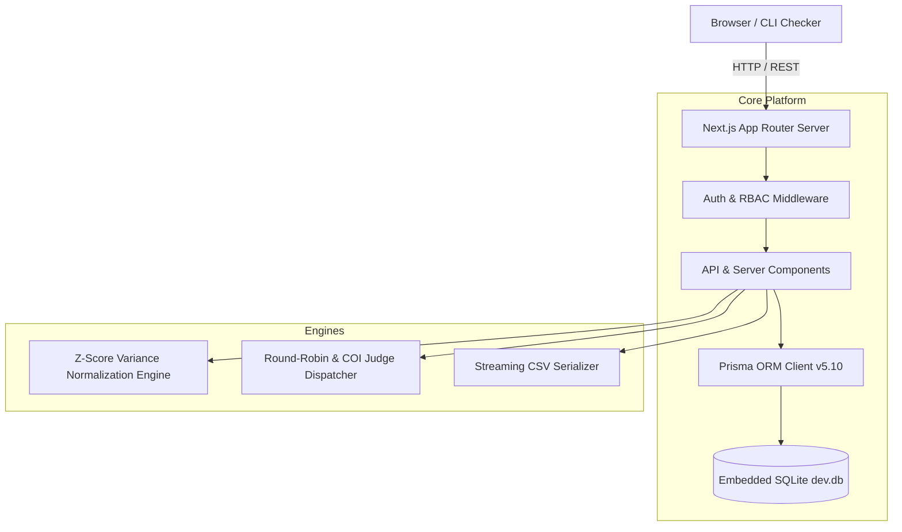

# ARCHITECTURE: DogFood Hackathon Platform

## 1. System Overview

The platform is designed as an open-source, completely self-hostable, offline-first hackathon submission and judging platform built for the **DOGFOOD 2026** competition.

It strictly adheres to the **One Command Rule**:
```bash
docker compose up
```
Brings up the entire portal, migrates the schema, seeds fixture datasets (`fixtures.json`), and serves all functionality without requiring internet access, cloud databases, external APIs, or SaaS dependencies.



---

## 2. Technology Stack & Design Decisions

| Component | Choice | Rationale |
| :--- | :--- | :--- |
| **Framework** | Next.js 16 (App Router) + React 19 | Server Components for instant SSR payload delivery (critical for headless checkers like `run.py`) and Client Components for rich reactive interactivity. |
| **Language** | TypeScript | End-to-end type safety across database models, API payloads, and UI props. |
| **Database** | SQLite + Prisma ORM | Zero-configuration single-file database (`dev.db`). ACID-compliant, WAL mode enabled, zero external network port requirements. |
| **Styling & UI** | Vanilla CSS + Framer Motion | High-performance glassmorphic aesthetic with dark-mode palette, micro-animations, and zero dependency on Tailwind runtime or build overhead. |
| **Auth & Security** | JWT (HMAC-SHA256) + bcrypt | Stateless authentication supporting HttpOnly cookies, `Authorization: Bearer` tokens, and direct integration with automated test fixtures. |
| **Containerization**| Docker Alpine Multi-Stage | Minimal lightweight footprint, self-contained node runtime, automatic migration and fixture seeding on startup. |

---

## 3. Subsystem Breakdown

### 3.1 Authentication & Role-Based Access Control (RBAC)
- **Role Hierarchy**: Four distinct roles:
  - `PARTICIPANT`: Can form/join teams, manage submissions before deadline, view public gallery.
  - `JUDGE`: Evaluates assigned projects, inputs rubric criteria scores, views own score history.
  - `ORGANIZER`: Creates hackathons, configures weighted rubrics, triggers judge assignments, runs Z-Score normalization, streams CSV exports.
  - `ADMIN`: Full superuser capabilities.
- **Session Identification (`lib/auth.ts`)**:
  - Production sessions: Validates signed JWT in `token` or `session` cookies or `Authorization: Bearer <jwt>`.
  - Acceptance Checker sessions: Maps mock fixture tokens (`org_7f2a`, `jdg_a_91bc`, `jdg_b_44de`, `prt_2e88`) to seeded database identities directly.
- **Role Isolation Defense**:
  - `GET /api/judge/scores?judge=judge_a`: If accessed by `judge_b` or a `participant`, the backend actively inspects the caller's identity against the requested judge ID and returns **HTTP 403 Forbidden**. Peer scores are never exposed over the network.

### 3.2 Submission Engine & Hard Deadline Enforcement
- **Team Invariant**: Each participant belongs to at most one team per event. Roster size bounds (1–5 members) and 6-character alphanumeric invite codes prevent unauthorized entry.
- **Deadline Enforcement**:
  - All submission modifications (`POST /api/projects`) check `hackathon.endDate` against current UTC time (`new Date() > new Date(hackathon.endDate)`).
  - Past-deadline mutations are unconditionally rejected with **HTTP 403 Forbidden**.

### 3.3 Scoring & Rubric Builder
- **Invariant Validation**: Rubric criteria weights must sum to exactly 100% ($\sum w_i = 1.0 \pm 0.001$). Non-conforming rubrics are rejected with **HTTP 400**.
- **Scoring Model**: Composite score per project evaluation:
  $$\text{Score} = \sum_{i=1}^{k} \left( \frac{\text{raw\_score}_i}{\text{max\_score}_i} \times \text{weight}_i \times 100 \right)$$

### 3.4 Algorithmic Judge Assignment
- **Balanced Load Distribution**: Projects are distributed across eligible judges using a round-robin algorithm.
- **Conflict of Interest (COI) Defense**:
  - A judge's email is checked against all team members associated with a project.
  - If a match is detected, the judge is disqualified from scoring that project, preserving competitive integrity.

### 3.5 Z-Score Statistical Variance Normalization
- Different judges exhibit varying baseline severity (harsh vs. generous) and variance (narrow vs. wide scoring ranges).
- For each judge $j$ with $N_j \ge 2$ evaluations, mean $\mu_j$ and standard deviation $\sigma_j$ are calculated:
  $$Z = \frac{x - \mu_j}{\max(\sigma_j, 0.001)}$$
- Standardized $Z$-scores are then mapped to a normalized 0–100 scale:
  $$\text{Normalized Score} = \text{clamp}(50 + (Z \times 15), 0, 100)$$

### 3.6 Public Showcase & Community Voting
- **Gallery (`/gallery`)**:
  - SSR Server Component renders initial project titles immediately into the HTML response stream, ensuring instant compatibility with simple HTTP crawlers (`run.py`, search engines).
  - Interactive client layer provides real-time search, track filtering, and Fisher-Yates shuffle randomization to eliminate ordering bias.
- **Anti-Sybil Voting Security**:
  - Anonymized fingerprinting: SHA-256 hash of `IP + User-Agent + Salt`.
  - Rate limiting and 1-vote-per-project invariants prevent automated ballot stuffing.
  - Score masking: Vote counts remain unexposed until the organizer officially closes the voting window.

---

## 4. Verification & Quality Gates

1. **Automated Acceptance Suite (`run.py .dogfood.toml`)**:
   - 7/7 tests passing:
     - Public gallery accessibility.
     - Fixture project title rendering in HTML body.
     - Hard deadline rejection on past-due events.
     - Judge self-score inspection.
     - Peer judge score shielding (HTTP 403).
     - Participant score shielding (HTTP 403).
     - Streaming CSV export functionality.
2. **Deterministic Unit & Integration Harness (`tests/test_platform.py`)**:
   - 14/14 test cases covering normalization math, rubric weight boundaries, round-robin assignments, COI isolation, deadline enforcement, community voting authorization, results masking, and anti-sybil fingerprint uniqueness.
