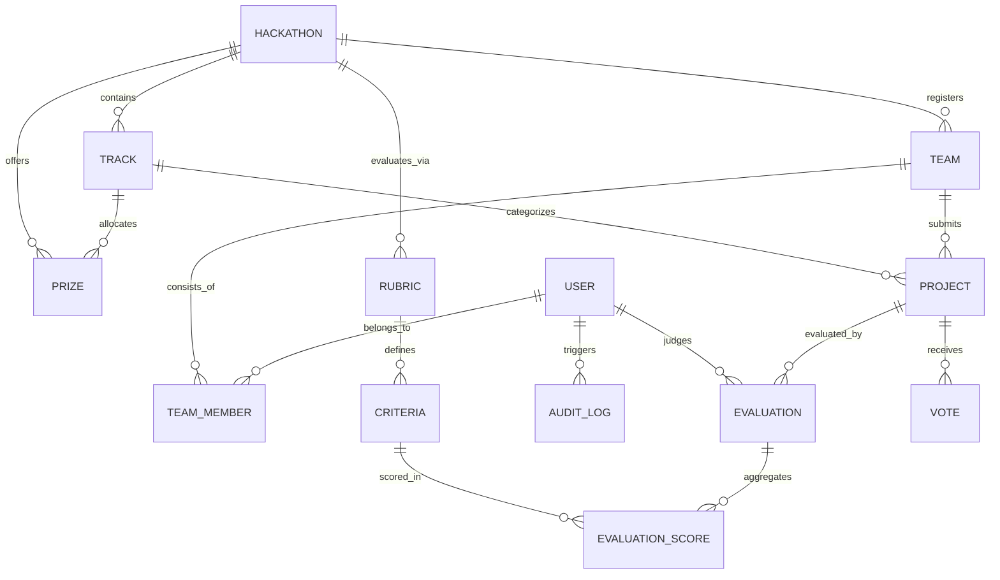

# DATA-MODEL: Schema Architecture, Invariants, Import & Export Paths

## 1. Relational Database Overview

The platform uses an embedded **SQLite** database governed via **Prisma ORM**. It is fully self-contained, offline-first, WAL-mode enabled, and requires zero external cloud database services.



---

## 2. Entity Dictionary & Attributes

### 2.1 `User`
- **`id`** (`String` PK, UUID): Unique identifier.
- **`email`** (`String` UNIQUE): User identity anchor.
- **`passwordHash`** (`String`): bcrypt salted hash (10 rounds).
- **`name`** (`String`): Display name.
- **`role`** (`String`, default `"PARTICIPANT"`): Enforced enum (`PARTICIPANT`, `JUDGE`, `ORGANIZER`, `ADMIN`).
- **`createdAt`** / **`updatedAt`** (`DateTime`).

### 2.2 `Hackathon`
- **`id`** (`String` PK): Event identifier (e.g. `evt_01`).
- **`name`** (`String`): Event title.
- **`description`** (`String`): Competition context and expectations.
- **`startDate`** (`DateTime` ISO 8601 UTC): Opening timestamp.
- **`endDate`** (`DateTime` ISO 8601 UTC): Hard submission cutoff deadline.
- **`votingOpen`** (`Boolean`): Community voting toggle.

### 2.3 `Track`
- **`id`** (`String` PK): Track identifier (e.g. `trk_01`).
- **`name`** (`String`): Category name (e.g. "Developer Tools").
- **`description`** (`String`): Focus scope.
- **`hackathonId`** (`String` FK): Owning event.

### 2.4 `Team` & `TeamMember`
- **`id`** (`String` PK): Team identifier (e.g. `tm_01`).
- **`name`** (`String`): Team name.
- **`joinCode`** (`String` UNIQUE): Cryptographic 6-character uppercase alphanumeric code (e.g. `A9X2K1`).
- **`hackathonId`** (`String` FK): Owning event.
- **Invariant**: Roster bound strictly between 1 and 5 members.
- **Invariant**: Participant can belong to at most one team per hackathon.

### 2.5 `Project`
- **`id`** (`String` PK): Project identifier (e.g. `prj_01`).
- **`name`** (`String`, 3-80 chars): Project title.
- **`description`** (`String`, Markdown): Project synopsis and architecture.
- **`repoUrl`** (`String`): Git repository URL.
- **`demoUrl`** (`String`): Live deployment or video link.
- **`status`** (`String`): `"DRAFT"` or `"SUBMITTED"`.
- **`teamId`** (`String` FK): Owning team (1 project per team).
- **`trackId`** (`String` FK): Target competition track.
- **Invariant**: All edits and new submissions locked after `hackathon.endDate`.

### 2.6 `Rubric` & `Criteria`
- **`Rubric`**: Container defining scoring methodology for an event.
- **`Criteria`**: Individual scoring dimension.
  - **`name`** (`String`): e.g. "Functionality", "Quality", "Innovation".
  - **`weight`** (`Float`): Percentage weight.
  - **`maxScore`** (`Float`): Upper boundary (e.g. 5.0 or 10.0).
  - **Invariant**: $\sum_{k=1}^m \text{weight}_k = 1.0 \pm 0.001$ (exactly 100%).

### 2.7 `Evaluation` & `EvaluationScore`
- **`Evaluation`**: Judge review container.
  - **`judgeId`** (`String` FK): Reviewer.
  - **`projectId`** (`String` FK): Project reviewed.
  - **`totalScore`** (`Float`): Calculated weighted sum: $\sum \text{score}_k \cdot \text{weight}_k$.
  - **`normalizedScore`** (`Float`): Standardized Z-score ($0 - 100$).
  - **`comment`** (`String`): Written critique and feedback.
  - **`completed`** (`Boolean`): Evaluation finalized.
  - **Constraint**: `@@unique([judgeId, projectId])` prevents duplicate assignments.
- **`EvaluationScore`**: Score per individual criteria breakdown.

### 2.8 `Vote` & `AuditLog`
- **`Vote`**: Community vote with `projectId`, `voterIpOrId`, and rate-limiting timestamp.
- **`AuditLog`**: Immutable ledger of administrative actions (`CREATE_HACKATHON`, `BATCH_ASSIGN_JUDGES`, `EXECUTE_SCORE_NORMALIZATION`, etc.).

---

## 3. Ingestion & Import Paths (`fixtures.json`)

The platform supports seamless ingestion of official DOGFOOD benchmark fixtures via `app/prisma/seed.js`:

```
fixtures.json (Event, Tracks, Judges, Teams, Projects, Scores)
                      │
                      ▼
            [prisma/seed.js Engine]
                      │
   ┌──────────────────┼──────────────────┐
   ▼                  ▼                  ▼
Hackathons & Tracks  Teams & Roster    Projects & Weighted Scores
(dev.db SQLite)      (dev.db SQLite)   (dev.db SQLite)
```

### Automatic Container Startup
On `docker compose up`, `app/start.sh` runs:
```sh
npx prisma db push --accept-data-loss
node prisma/seed.js
```
Ensuring the portal boots pre-seeded with all 41 fixture projects, 30 judges, 40 teams, and 126 evaluations.

---

## 4. Export Paths

### 4.1 Streaming CSV Export (`/api/export.csv`)
Authorized Organizers and Admins can export raw and normalized evaluations:
- **Endpoint**: `GET /api/export.csv`
- **Headers**: `Content-Type: text/csv; charset=utf-8`
- **Format**:
  ```csv
  Evaluation ID,Project ID,Project Title,Track,Team Name,Judge ID,Judge Name,Raw Score,Normalized Score,Completed,Comment
  "ev_1","prj_01","Glass Signal","Security","NorthKiln","jdg_08","Marek Nowak","2.60","52.40","YES","Runs clean."
  ```

### 4.2 JSON REST APIs
- `GET /api/events`: Event definitions, tracks, and prize metadata.
- `GET /api/projects/public`: Public showcase feed with Fisher-Yates shuffle randomization.
- `GET /api/judge/scores`: Role-isolated judge scores view.
