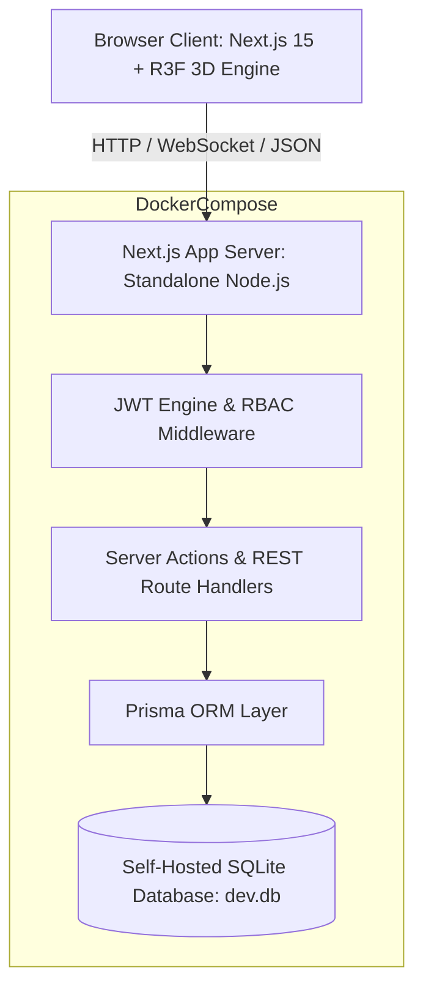
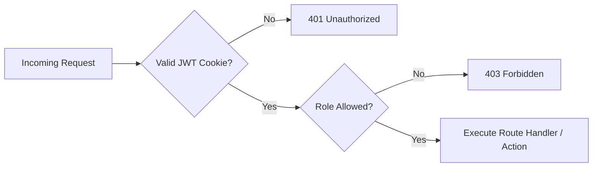

# System Architecture Specification

## 1. High-Level Architectural Overview

The **Dog Food Hackathon Platform** is engineered as an offline-first, single-node, self-hostable monolith delivering high performance, strict role isolation, real-time 3D user interfaces, and deterministic judging normalization.

---

## 2. Infrastructure & Offline-First Principles

### 2.1 Zero-Cloud Reliance
- **Strict Self-Containment**: Operates cleanly on air-gapped laptops without internet access or DNS resolution.
- **Embedded Database**: Uses an optimized SQLite engine via Prisma (`file:./dev.db`), eliminating the latency, memory footprint, and network flakiness of external DB services.
- **Static Asset Bundling**: All 3D meshes, procedural shaders, fonts, and assets are embedded locally within the build artifact.

### 2.2 Container Topology (`docker-compose.yml`)
- Built from a hardened Alpine-based multi-stage Dockerfile (`node:20-alpine`).
- Production runtime runs as an unprivileged user (`nextjs:nodejs`, UID 1001).
- Mounts persistent volume `db_data` at `/app/prisma` to guarantee zero data loss during restarts.
- Auto-initializes schema migrations on boot via `start.sh` without manual operator intervention.

---

## 3. Frontend Architecture

### 3.1 Next.js 15 App Router Architecture
- **Server Components (RSC)**: Used for data-dense views (Dashboards, Hackathon Details, Gallery grids) to minimize client bundle sizes.
- **Client Components ('use client')**: Isolated strictly to interactive forms, animated transitions (Framer Motion), and 3D scenes.
- **Dynamic Imports with SSR Disabling**: R3F 3D components (`ThreeScene.tsx`) utilize `next/dynamic({ ssr: false })` to eliminate WebGL canvas hydration mismatches.

### 3.2 Design System & Styling Pipeline
- **Engine**: Pure Vanilla CSS design tokens declared in `src/app/globals.css`.
- **Aesthetic**: Deep dark-mode cyberpunk glassmorphism with dynamic radial gradients and CSS backdrop filters (`backdrop-filter: blur(12px)`).
- **Typography**: Dual-font typography stack pairing Outfit (headings) with Inter (body).

---

## 4. Backend & Security Architecture

### 4.1 Authentication & Session Management
- **Stateless JWT Tokens**: Signed using HMAC SHA-256 (`jsonwebtoken` / `jose`), packed into secure `httpOnly`, `sameSite=lax` cookies.
- **Password Security**: Salted hashes generated via `bcryptjs` with cost factor 10.
- **Role Isolation (RBAC)**: Rigid four-tier permission model strictly validated server-side on every request:
  1. `ADMIN`: System-wide audit logs, global configuration, user impersonation, database exports.
  2. `ORGANIZER`: Event creation, track & prize config, rubric definitions, judge assignments, results publishing.
  3. `JUDGE`: Evaluation queue access, rubric-based grading, draft scoring.
  4. `PARTICIPANT`: Team formation, invite generation, project submission drafts, community voting.

---

## 5. Scoring & Normalization Subsystem

### 5.1 The Normalization Problem
In hackathons, individual judges exhibit distinct scoring biases (some score strictly between 50-70, others generously between 85-100). Raw averages distort genuine project rankings.

### 5.2 Z-Score Normalization Engine
The platform calculates standardized Z-scores across all submissions judged by a given judge:

$$z_{i,j} = \frac{x_{i,j} - \mu_j}{\sigma_j}$$

Where:
- $x_{i,j}$ = Raw score given by Judge $j$ to Project $i$.
- $\mu_j$ = Mean score given by Judge $j$ across all assigned projects.
- $\sigma_j$ = Standard deviation of scores awarded by Judge $j$.

Final normalized project score is translated back to an intuitive scale (0–100):

$$S_i = 50 + 10 \cdot \frac{1}{|J_i|} \sum_{j \in J_i} z_{i,j}$$

---

## 6. Auditability & Observability
- **Audit Logging**: Any state change (rubric update, score submission, vote cast, role promotion) automatically inserts an immutable entry into the `AuditLog` table.
- **Export Capabilities**: Clean CSV streaming endpoints for raw scores, normalized rankings, team rosters, and audit trails.
