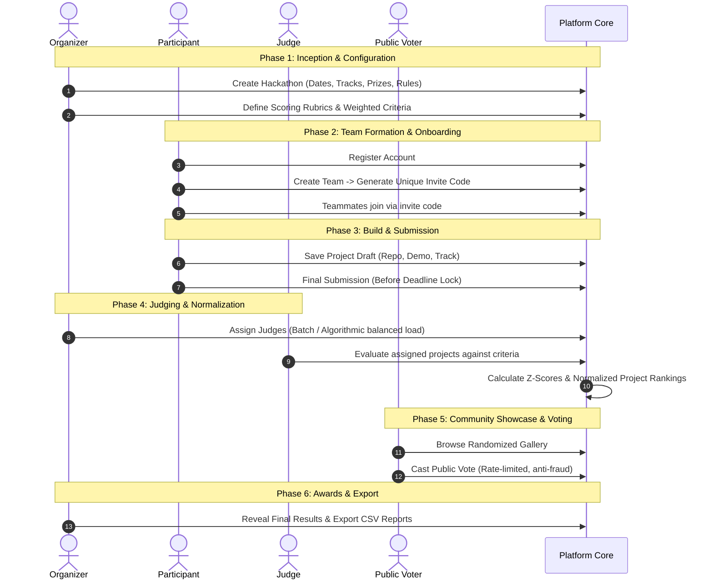
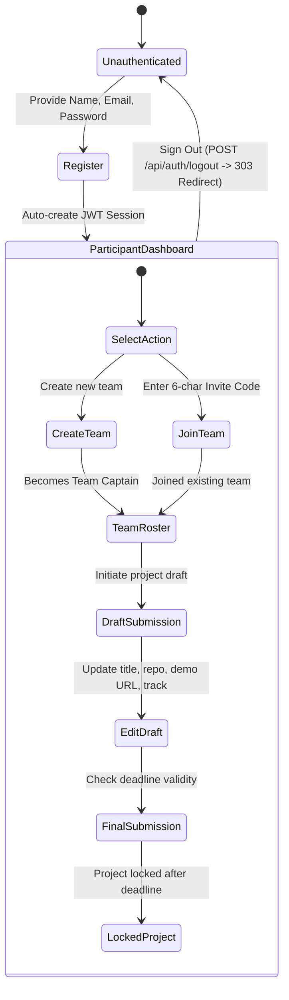
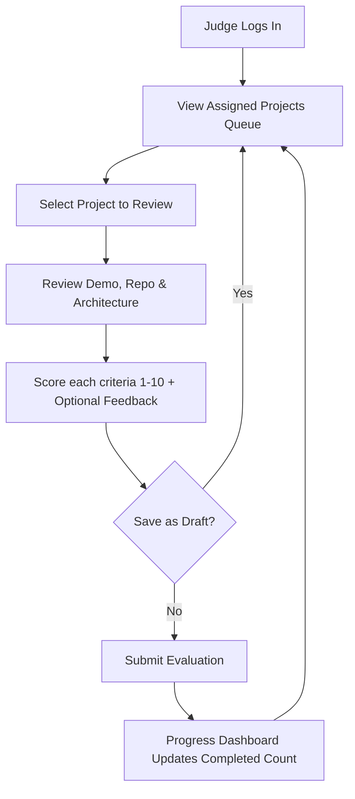

# Application Flow & Lifecycle Guide

## 1. End-to-End Hackathon Lifecycle

The platform governs the entire competition lifecycle across six distinct chronological phases:

---

## 2. Participant Journey Flow

---

## 3. Organizer Journey Flow

1. **Dashboard Entry**: Access high-level event telemetry and status metrics.
2. **Event Configurator**:
   - Set competition start and end timestamps (ISO 8601).
   - Configure parallel Tracks (e.g., "AI & Automation", "Decentralized Systems", "Developer Tools").
   - Define track prizes and sponsor bounties.
3. **Rubric Builder**:
   - Establish criteria definitions (e.g., "Technical Complexity", "UI/UX Polish", "Originality").
   - Assign percentage weights (summing to 100%) and max raw score ranges (e.g., 1-10).
4. **Judge Assignment**:
   - Review registered judges.
   - Execute **Algorithmic Assignment**: round-robin distribution ensuring each project receives at least $N$ independent reviews without conflict of interest.
5. **Results Calibration**:
   - Preview raw score dispersion.
   - Run Normalization Pipeline.
   - Toggle Public Voting visibility.
   - Stream one-click CSV dumps for judges, projects, and rankings.

---

## 4. Judge Journey Flow

---

## 5. Public Community & Voting Flow

1. **Public Showcase**: Open access gallery displaying all submitted projects without requiring authentication.
2. **Fisher-Yates Ordering**: Project cards are served in randomized order to prevent position bias across voters.
3. **Anti-Sybil Voting Guard**:
   - Client fingerprinting + IP hashing.
   - Rate limiting enforced at 5 votes / IP / hour.
   - Real-time results remain cryptographically hidden while the voting window is active.
