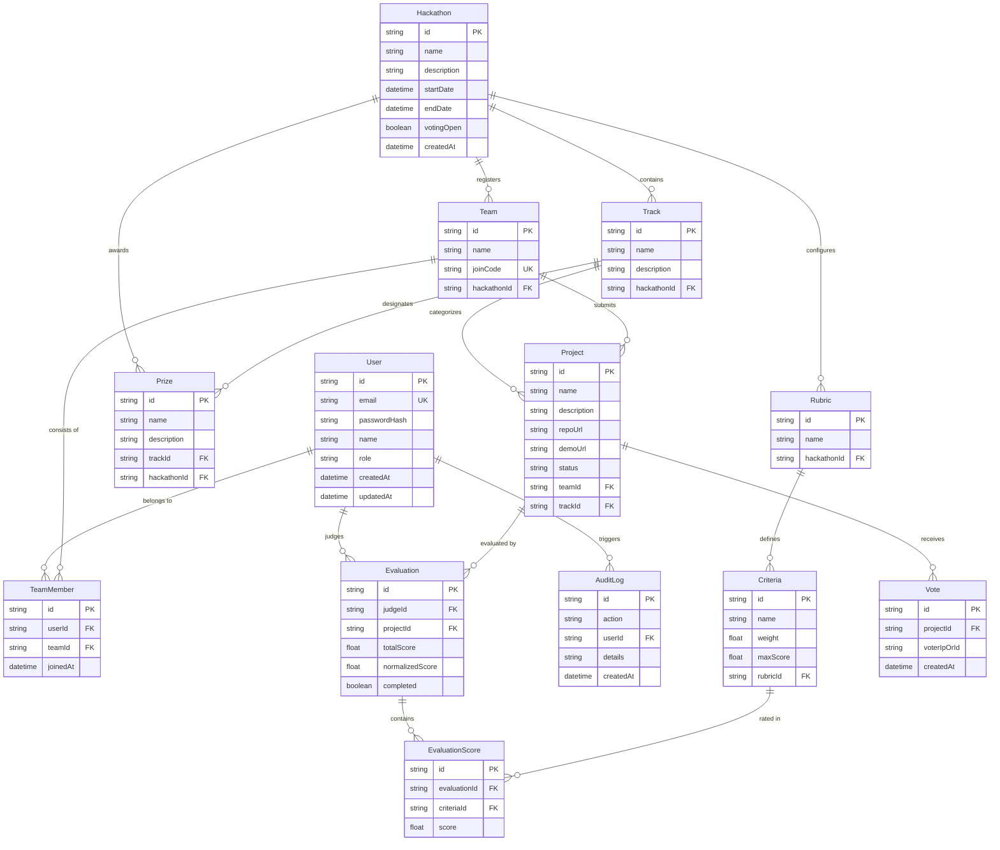

# Database Schema & Entity-Relationship Specification

## 1. Entity-Relationship Diagram

---

## 2. Table Definitions & Constraints

### 2.1 `User`
- `id`: Primary Key (UUIDv4 string).
- `email`: Unique string identifier used for credentials.
- `passwordHash`: Salted bcrypt string.
- `role`: Enum-like string constraint (`PARTICIPANT`, `JUDGE`, `ORGANIZER`, `ADMIN`).

### 2.2 `Hackathon`
- `startDate` / `endDate`: UTC timestamps defining the submission window.
- `votingOpen`: Boolean flag controlling public community voting availability.

### 2.3 `Team` & `TeamMember`
- `joinCode`: Unique 6-character alphanumeric string for invite links.
- Join constraint: A user can belong to only one team per hackathon.

### 2.4 `Project`
- `status`: String constraint (`DRAFT` or `SUBMITTED`).
- Relationships: Linked directly to `Team` (one-to-one or one-to-many) and optional `Track`.

### 2.5 `Rubric` & `Criteria`
- `weight`: Floating-point scalar representing percentage of total score (e.g. `0.25` for 25%).
- `maxScore`: Maximum point ceiling per criteria (e.g., `10.0`).

### 2.6 `Evaluation` & `EvaluationScore`
- `totalScore`: Computed weighted raw score sum.
- `normalizedScore`: Re-scaled Z-score computed across all submissions evaluated by the same judge.
- `completed`: Boolean indicating whether evaluation has been finalized.

### 2.7 `Vote`
- `voterIpOrId`: Cryptographic SHA-256 digest of client IP and User-Agent to enforce rate limits and duplicate prevention.

### 2.8 `AuditLog`
- `action`: Human-readable event code (e.g., `RUBRIC_CREATED`, `DEADLINE_MODIFIED`, `SCORE_SUBMITTED`).
- `details`: Serialized JSON payload capturing the before/after state diff.
